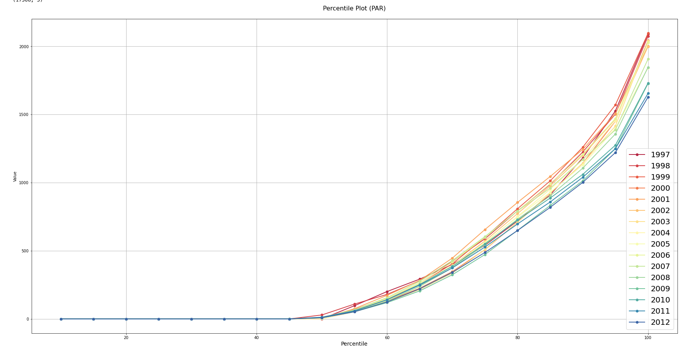
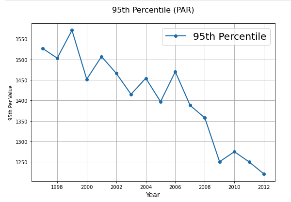
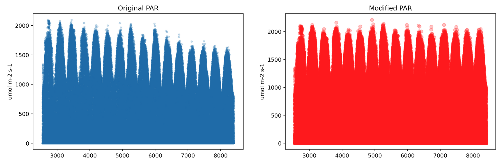
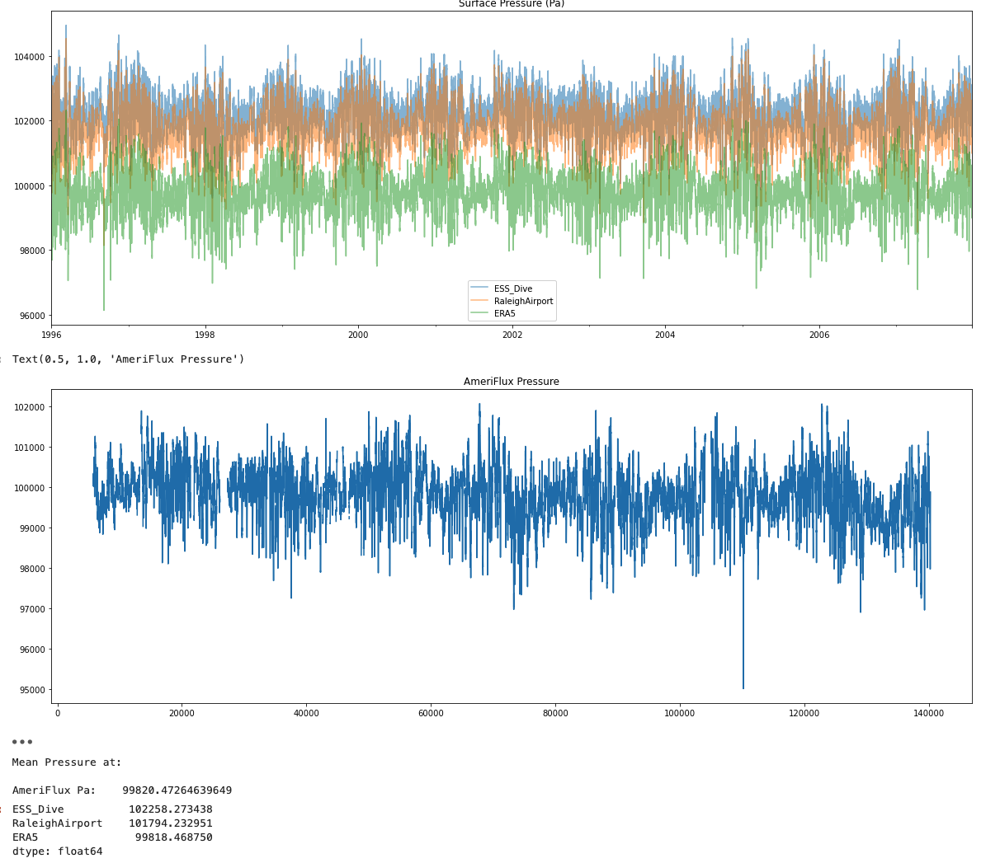

# PrepMetData
This repository is created to help one with tools to process meterological data into continuous timeseries in formats that are in land model readable format.

# Processing of Duke Met Data
by Bharat Sharma and Anthony Walker <br>
sharmabd@ornl.gov
=============================

Steps:
1. Fixing the Duplicate/Incorrect time information in the original data: `FixingDupicateDuke.py`
2. Data Processing and variable calculations: `MET_Data_Processing.py`
3. Based on outputs from 2., process data in FACEMDS format: `MET_Data_Process2FACEMDS.py`
4. Based on the outputs from 3., we can make ELM input met data files : `METDATA2ELM.py`
5. Based on the outputs from 4., compare the variables from the exising ELM Data and new ELM Data variables and save files for every month separately; see `ELM_Output_Comp_Resave.ipynb`

## 1. Errors in Input data.
### 1.1 Fixing the duplicate time index
There are some duplicate/incorrect time information in the original data in the year 2007 and 2009 across all variables. <br>
We wrote a code to fix the files : `FixingDupicateDuke.py` <br>
Usage example:
`python FixingDupicateDuke.py -file_ci /Users/ud4/repos/GitHub/FATESFACE/Jupyter_Notebooks/DuplicateDukeDataCorrectIndexOnly.txt -path_data /Users/ud4/Documents/FACEMDS/MET_Data_Processing/Oren_2022_DUKE_Met/data/ -replace_file yes` <br>
This will replace tge gap filled files with correct values <br>
You will also need to download the file `DuplicateDukeDataCorrectIndexOnly.txt` <br>

### 1.2  Time column has inconsistent time values
Some of the variable have an incorrect time in the observation dataset.
E.g. below is the SLT. Instead of 1500, the data reads 1460. There are 440 instances just for SLT.

```
4349 1999,3378.56,91,1400,11,11.3,11.2,11.5,11.7,12.6
4350 1999,3378.58,91,1430,11.1,11.4,11.2,11.6,11.8,12.6
4351 1999,3378.6,91,1460,11.2,11.4,11.3,11.6,11.9,12.6
4352 1999,3378.63,91,1530,11.2,11.5,11.4,11.7,12,12.7
4353 1999,3378.65,91,1600,11.3,11.5,11.4,11.8,12,12.7
```

The fix for this in the `MET_Data_Processing.py`

## 2. Data Processing Sub-hourly

### Variable "AT"
- Air Temperature (Degree Celsius)
- Renamed to 'Tair'
- Calculated the mean of the following plots every time step for the from 1997 to 2012
  - 'R1uat', 'R2uat', 'R3uat', 'R4uat','R5uat', 'R6uat', 'R7uat', 'R8uat'

### Variable "Precip"
- Precipitation (mm)
- Renamed to 'Rainf'
- Calculated the mean of the following plots every time step for the from 1997 to 2012
  - 'FACE.PO'

### Variable "RH"
- Relative Humidity
- Renamed to 'RH'
- Calculated the mean of the following plots every time step for the from 1997 to 2012
  - 'R1urh', 'R2urh', 'R3urh', 'R4urh','R5urh', 'R6urh', 'R7urh', 'R8urh'

### SM:SM
- Soil moisture integrates measurements from 0 to 30cm depth
- Renamed to 'SM'
- Calculated the mean of the following plots every time step for the from 1997 to 2012
  - 'R1urh', 'R2urh', 'R3urh', 'R4urh','R5urh', 'R6urh', 'R7urh', 'R8urh'

### SWP:SWP
- Soil water potential
- Renamed to 'SWP'
- Calculated the mean of the following plots every time step for the from 2007 to 2012
  - 'R1swp', 'R2swp', 'R3swp', 'R4swp','R5swp', 'R6swp'

### Variable "SVP"
- Saturated Vapor Pressure (kPa)
- Renamed to 'SVP'
- Calculated the mean of the following plots every time step for the from 1997 to 2012
  - 'R1usvp', 'R2usvp', 'R3usvp', 'R4usvp','R5usvp', 'R6usvp', 'R7usvp', 'R8usvp'

### Variable "VPD"
- Vapor pressure deficit (kPa)
- Renamed to 'VPD'
- Calculated the mean of the following plots every time step for the from 1997 to 2012
  - 'R1uvpd', 'R2uvpd', 'R3uvpd', 'R4uvpd','R5uvpd', 'R6uvpd', 'R7uvpd', 'R8uvpd'


### Variable "SLT"
- Soil Temperature (Degree Celsius) at 15 cm Depth
- Renamed to 'SLT'
- Calculated the mean of the following plots every time step for the from 1997 to 2012
  - 'R2slt', 'R3slt', 'R4slt','R5slt', 'R6slt'
  - Other plots had varied depths over time hence, ignored them for this calculation


### Variable "PAR"
- Photosynthetically active radiation (umol/m^2\*s)
- Renamed to 'PAR'
- Calculated the mean of the following plots every time step for the from 1997 to 2012
  - 'PAR'
  - 'PAR' had values from only one plot for 1997-2007 and from two plots for 2008-2012, which were averaged and saved in the same csv/txt file.

### Variable "Rn"
- Net radiation (W/m^2)
- Renamed to 'Rn'
- Calculated the mean of the following plots every time step for the from 1997 to 2012
  - 'Rn'
  - 'Rn' had values from only one plot for 1997-2007 and from two plots for 2008-2012, which were averaged and saved in the same csv/txt file.


## Modifications to "PAR"
- The values of PAR are decreasing over time in the original data. See  <br>
- We assume that this is occuring to the degrading PAR sensor. <br>
- Based on the 95th percentile values, a scalling factor was calculated to attenuate declining PAR .
- The figure below shows the comparison of the original and modified PAR. .
- The modified PAR will replace the original PAR in the dataset.

## Varibles copied from Existing FACE MDS data as is:
 - aCO2
 - eCO2
 - Ndep
 - SolarElevation

### Variable "SWdown"
- Based on: PAR
- umolm-2s-1 to W/m2 by dividing with 2.3

### Variable "LWdown"
- based on the implementation in Oneflux:  https://github.com/fluxnet/ONEFlux/blob/9201beb15e6eca57bd6fd23a16cb5e46d4e2de7a/oneflux_steps/qc_auto/src/main.c#L2851-L2882
## Surface Pressue

 <br>
We compared Pressure from 4 sources:
- Existing ESS DIVE (based on NARR)
- [Raleigh Airport Pressure Readings](https://www.ncei.noaa.gov/access/search/data-search/local-climatological-data?dataTypes=HourlySeaLevelPressure&dataTypes=HourlyStationPressure&dataTypes=HourlyWindDirection&dataTypes=HourlyWindSpeed&pageNum=2&startDate=1996-01-01T00:00:00&endDate=2013-01-01T23:59:59&bbox=36.133,-79.020,35.828,-78.714)
- ERA5 Pressure (see : `Download_ERA5_Data.py` for links and way to request automated downloads)
- Ameriflux Duke Station 3 ([Citations](misc/citations_for_site_data_BASE-BADM_20230915.csv))

The mean surface pressure (Pa) are:
- ESS DIVE/NARR : 102258
- Raleigh Airport : 101794
- ERA5: 99818
- Ameriflux: 99820

Based on this we are using the pressure data from ERA5. See `Download_ERA5_Data.py` to automate downloading data from ERA5.

## Wind

We used wind data from ERA5 which provides u10 and v10 wind components in m/s <br>
we calculate mean wind as: `Wind = (u10^2+v10^2)^0.5`

# Variable names and units

```

'YEAR':'Year of measurement',
'DTIME':'Fractional day of year',
'DOY':'Day of year',
'HRMIN':'Hour:minute, marked at the middle of measurement interval with last two digits as minute',
'Rainf':'Total Precipitation over a time step of measurement',
'Rainf_f': 'gap-filling flag, 0 = measured, 1 = derived from other variables, 2 = filled by \
exising FACEMDS data, 3 = filled by data from nearby weather station, 4 = \
filled by using ERA5 data',
'Tair':'Mean air temperature over a time step of measurement',
'Tair_f':'gap-filling flag',
'RH':'Mean relative humidity over a time step of measurement',
'RH_f':'gap-filling flag',
'VPD':'Vapor pressure deficit, kPa',
'VPD_f':'gap-filling flag',
'PAR':'Incident or downward photosynthetically active radiation',
'PAR_f':'gap-filling flag',
'SM':'Soil Moisture integrates measurements from 0 to 30cm depth',
'SM_f':'gap-filling flag',
'SWP':' Soil Water Potential',
'SWP_f':'gap-filling flag',
'SVP':'Saturated Vapor Pressure',
'SVP_f':'gap-filling flag',
'Rn':'Net Radiation',
'Rn_f':'gap-filling flag',
'SLT':'Soil Temperature',
'SLT_f':'gap-filling flag',
'Wind':'Mean wind speed over a time step of measurement, m/s',
'Wind_f':'gap-filling flag',
'PSurf': 'Surface barometric pressure, Pa',
'PSurf_f':'gap-filling flag',
'aCO2': 'Daily mean ambient CO2 concentration in daytime (solar angle > 15), ppmv',
'eCO2': 'Daily mean elevated treatment CO2 concentration in daytime (solar angle >15), ppmv',
'Ndep': 'Total N deposition over a time step of measurement (30 minutes), g/m2/(30-minute)',
'SolarElevation': 'Solar elevation angle, degree'
```